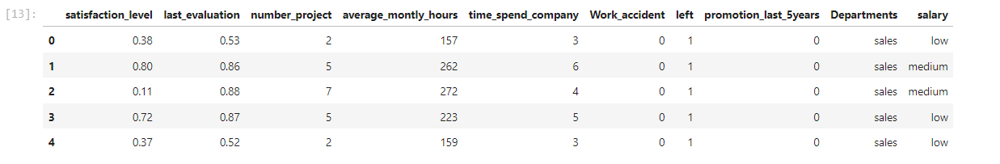
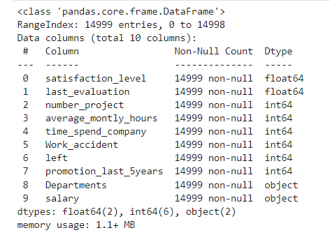
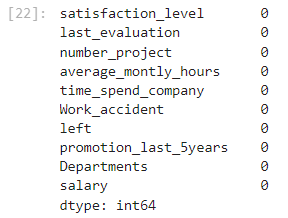
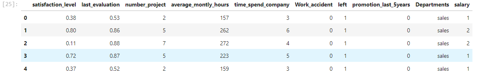
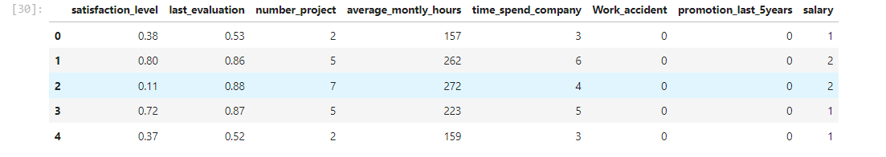

# Implementation-of-Decision-Tree-Classifier-Model-for-Predicting-Employee-Churn

## AIM:
To write a program to implement the Decision Tree Classifier Model for Predicting Employee Churn.

## Equipments Required:
1. Hardware – PCs
2. Anaconda – Python 3.7 Installation / Moodle-Code Runner

## Algorithm
## Step 1:
Import pandas library to read csv or excel file.

## Step 2:
Import LabelEncoder using sklearn.preprocessing library.

## Step 3:
Transform the data's using LabelEncoder.

## Step 4:
Import decision tree classifier from sklearn.tree library to predict the values.

## Step 5:
Find the accuracy of the model.

## Step 6:
Predict the values.

## Step 7:
End the program.

## Program:
```
/*
Program to implement the Decision Tree Classifier Model for Predicting Employee Churn.
Developed by: vishwa rathinam s
RegisterNumber:  212221240063

import pandas as pd
data = pd.read_csv("Employee.csv")

data.head()

data.info()

data.isnull().sum()

data["left"].value_counts()

from sklearn.preprocessing import LabelEncoder
le = LabelEncoder()

data["salary"] = le.fit_transform(data["salary"])
data.head()

x = data[["satisfaction_level","last_evaluation","number_project","average_montly_hours","time_spend_company","Work_accident","promotion_last_5years","salary"]]
x.head()

y = data["left"]

from sklearn.model_selection import train_test_split
x_train,x_test,y_train,y_test = train_test_split(x,y,test_size = 0.2,random_state = 100)

from sklearn.tree import DecisionTreeClassifier
dt = DecisionTreeClassifier(criterion = "entropy")
dt.fit(x_train,y_train)
y_pred = dt.predict(x_test)

from sklearn import metrics
accuracy = metrics.accuracy_score(y_test,y_pred)
accuracy

dt.predict([[0.5,0.8,9,260,6,0,1,2]])
*/
```

## Output:
DATA.HEAD():



DATA.INFO():



DATA.ISNULL().SUM():



DATA.VALUE_COUNTS:


DATA.HEAD()USING LABLE ENCODER:




[X.HEAD():



ACCURACY:


PREDICTION:


## Result:
Thus the program to implement the  Decision Tree Classifier Model for Predicting Employee Churn is written and verified using python programming.
